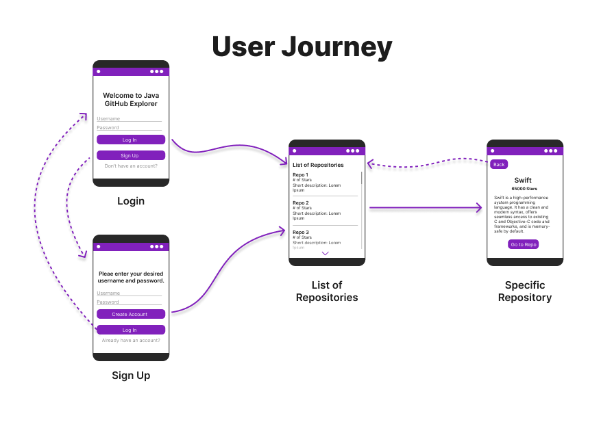

# Java GitHub Explorer
The GitHub Java Explorer is an Android mobile application designed to help users discover and explore top Java projects on GitHub. This app can be useful for Java developers and enthusiasts as there are many projects on GitHub, and narrowing them down by language and popularity can be a boring task. The app will simplify this by categorizing and presenting these projects in a way that is easy to navigate. By doing so, it helps the user to find projects of interest, either for learning, collaboration, or inspiration.

---

## Objective and Scope of the Project
The objective of our app is to provide a user-friendly platform where users can seamlessly find and explore top Java projects based on the project’s number of stars. After finding the project, they can be redirected to GitHub’s official website by further clicking on the links. This app consists of a front-end coded in Android Framework, a back-end using Java Spring Framework, and a MongoDB database.

### Main Targets
- Display a list of top Java projects from GitHub
- Offer filter, sort, and search functionalities by getting user-inputs
- Display detailed project information (title, stars, date, description, image, etc.)
- Redirect users to the official GitHub repository via a browser

---

## Back-End
- Retrieve project details
- Store the data in a MongoDB database
- User login/authentication for personalization and profiles

---

## Front-End
1. Log-in or Sign-up screen for entrance (for user profiles)
2. Fetch a list of top Java projects via GitHub’s API
3. Landing screen with a list of projects (scrollable)
4. ~Filtered list of projects screen (based on tags defined by the user)~
5. ~Search results screen (queried by the user)~
6. Full description of the project screen (can redirect to GitHub)
